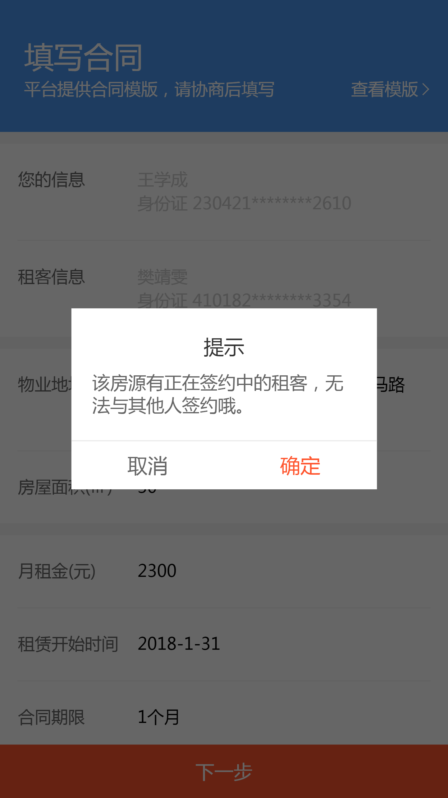

# 使用方法
* 1.引入本指令

```javascript
import { Dialog } from "fe-v-ui";
Vue.use(Dialog);
```
* 2.使用

```javascript
      this.$dialog({
          title:'提示',
          content: "该房源有正在签约中的租客，无法与其他人签约哦。",
          confirmBtn:'确定',
          cancelBtn:'取消',
          confirmCallback: function() {},
          cancelCallback: function() {},
      });
```
* 3.实际效果


# 备注
* 如果只需要显示确定按钮，cancelBtn留空即可。
* 如果需要人为换行，content字段可以传入数组
```javascript
      this.$dialog({
          title:'提示',
          content: ['line1','line2'],
          confirmBtn:'确定',
          cancelBtn:'取消',
          confirmCallback: function() {},
          cancelCallback: function() {},
      });
```