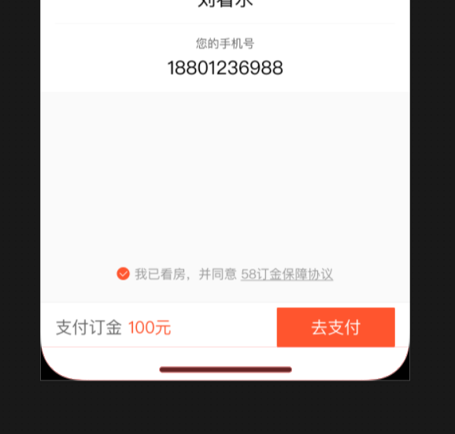

# 使用方法
* 1.引入本指令

```javascript
import { IphoneXBottomBtn } from "fe-v-ui";
Vue.use(IphoneXBottomBtn);
```
* 2.将本指令绑定到底部button上

```html
<p v-iphone-x-bottom-btn>提交</p>
```
* 3.实际效果


# 实现原理
检测是否是iphonex，如果是的话，在绑定该指令的元素上添加

```css
bottom: .9rem;
margin-bottom: .9rem;
```